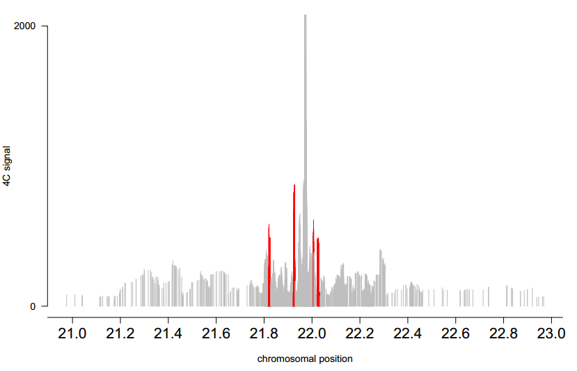

# peakC (visualize) configure


## Introduction

+ peakC an R package for the analysis of 4C/Capture-C/PCHiC data.
+ peakC: a flexible, non-parametric peak calling package for 4C and Capture-C data (title) (PMID : 29800273) (2018 , NAR)


## Require Software

+ R (any recent version)
+ isotone package (from CRAN)
+ devtools (for installation from github, not required for running the package)


## Installing

By far the easiest is to install peakC directly from GitHub. The following command will enable installation using devtools.

+ library (devtools)
+ install_github("deWitLab/peakC")


## peakC data structure 

The basic data structure for a (single) 4C/Capture-C/PCHiC experiment is a **two-column matrix**, with one column for the **position of the fragment (end)** and one column with the **number of reads (coverage, 4C signal).**

#### Functions for reading in data

+ **readqWig:** reads a simple two column file (wig file)
+ **readMatrix:** reads multiple matrix files at ones, reture a list
+ **readMultiple:** like read multiple, but for wig files
+ **readMultiColumnFile:** reads a multiple column file, 1st column is fragment position, the rest of the columns are 4C/Capture-C/PCHiC data columns


## Single experiment 4C analysis

4C mapping (perl) analysis result can be used to downstream analysis. (For example, peakC)

#### **1.Get two-column matrix data**

+ Data base on 4C mapping (perl) analysis result, come from mapping_pipeline.pl step.

+ Data from mapping/output/file.sam.

+ To get matrix data you should run the following command:

  ```shell
  less $1 cut -f1,3,4 > result/pos.txt
  ## $1 name of sam file
  ## result will be place in directory of mapping/output/result/
  ```

  ```perl
  #!/usr/bin/perl
  use warnings;
  use strict;
  use utf8;
  
  my $fi = "result/pos.txt";
  open my $I , '<' , $fi or die "$0 : failed to open input file '$fi': $!\n"; 
  my $fo = "result/pos_count.txt";
  open my $O , '>' , $fo or die "$0 : failed to open outfile fike '$fo' :$!\n";
  select $O;
  
  my %hash;
  while (<$I>) {
      chomp;
      unless (/^@/) {
          my @f = split /\t/;
          my $id = $f[0];
          my $pos = $f[2];
          push @{$hash{$pos}},$id;
      }
  
  }
  
  foreach my $pos (sort keys %hash) {
     my @vs = @{$hash{$pos}};
     my $num = @vs;
     print "$pos\t$num\n";
  }
  ```

  

#### **2. Read in the data**

```R
library(devtools)
library(peakC)

dir <- "path of input file"
dio <- "path of output file"
data <- readMultiple(file.path(dir,"pos_count.txt"), vp.pos = 21974218,window=200e3)
 ### vs.pos is position of viewpoint
 ### window is select the fragment in the 200kb genome region downstream and upstream        of the viewpoint
```


#### **3.Plot the significant fragments**

```R
res <- single.analysis(data=data[[1]],vp.pos= 21974218)

pdf(file.path(dio,"name.pdf"),height = 7,width = 10)  
plot_C(res,num.exp = 0, y.min = 0, y.max = 2000)
dev.off()

##The significant fragment windows are shown in red
```




